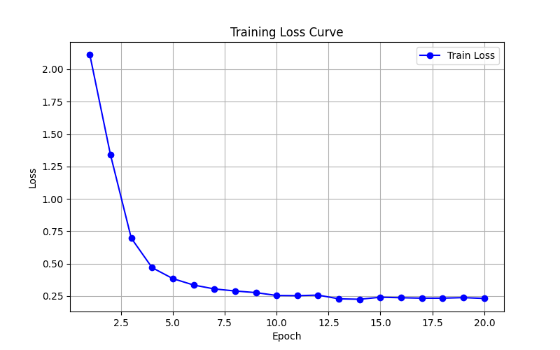
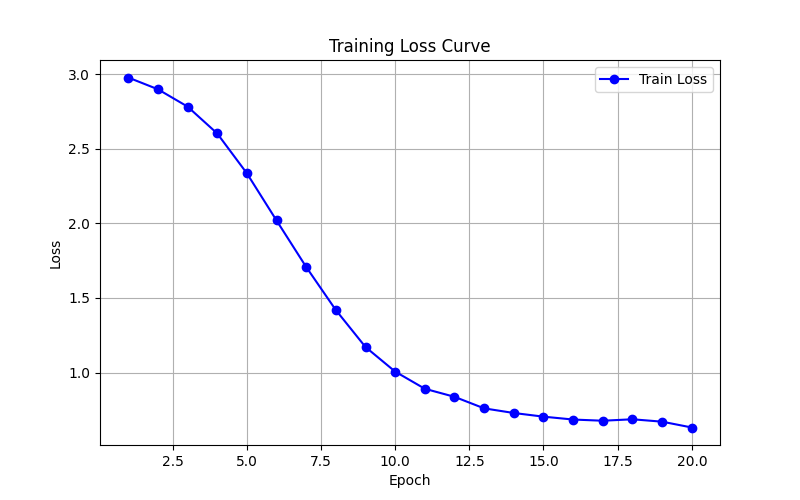
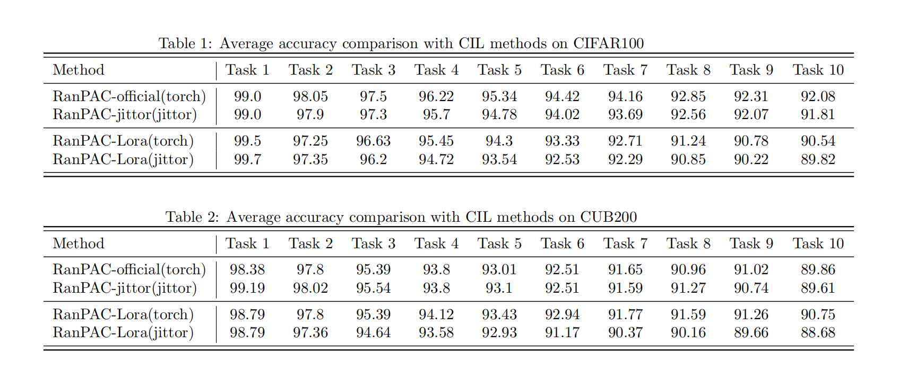

# 🚀 RanPAC-jittor

> ⚡ **RanPAC 的 Jittor 实现版本**  
> 一个用于持续学习的随机投影预训练模型。

---

## 📚 项目简介
本项目为论文 [RanPAC: Random Projections and Pre-trained Models for Continual Learning](https://arxiv.org/pdf/2307.02251) 提出方法的 **Jittor 框架重写版**，提供了数据准备、训练、评估等完整流程。

- 🔥 基于 [Jittor](https://github.com/Jittor/jittor) 的高效实现
- 📈 支持多种持续学习数据集
- 📝 输出可复现的训练日志、loss 曲线
- 🏆 提供与原论文 PyTorch 实现的性能对比

---

## ⚙️ 环境配置

### 1. 克隆项目
```bash
git clone https://github.com/Fluoroantimonic-H/RanPAC-jittor.git
cd RanPAC-jittor
````

### 2. 安装依赖

```bash
pip install -r requirements.txt
```

项目基于：

* Python >= 3.7
* Jittor >= 1.3.9

如需 GPU 加速，请在 Linux 环境下构建项目，确保 Jittor 的 CUDA 驱动正常。

---

## 📂 数据准备

### 数据集下载

除了 CIFAR100, 数据集下载后需要将其移动到相对目录 "./data/dataset_name/train/" 和 "./data/dataset_name/test/" 下。

> **CIFAR100**: 无需手动下载 \
> **CUB200**:  Google Drive: [link](https://drive.google.com/file/d/1XbUpnWpJPnItt5zQ6sHJnsjPncnNLvWb/view?usp=sharing) or Onedrive: [link](https://entuedu-my.sharepoint.com/:u:/g/personal/n2207876b_e_ntu_edu_sg/EVV4pT9VJ9pBrVs2x0lcwd0BlVQCtSrdbLVfhuajMry-lA?e=L6Wjsc)  
---

## 🚀 训练脚本

### 单次训练

```bash
python jt_main.py -i 7 -d cifar224
```

-  -i 可以从 0 到 7 中选择

    - ViT-B/16 backbone:
        - 0 is joint linear probe (only implemented for CIL datasets, not DIL)
        - 1 is joint full fine tuning (only implemented for CIL datasets, not DIL)
        - 2 is NCM, no PETL
        - 3 is RANPAC without RP and without PETL
        - 4 is RanPAC without PETL
        - 5 is NCM with PETL
        - 6 is RANPAC without RP
        - 7 is RanPAC


-  -d 为数据集，可以从 'cifar224', 'cub'中选择

---

## 📝  loss 曲线


* CIFAR100 loss 曲线：



* CUB200 loss 曲线：



---

## 🏆 性能对比

* jittor 实现与 pytorch 实现性能对比：
* （官方实现中的 PETL 方法使用了adapter，我在看过 CVPR'24 的 InfLoRA 后尝试使用 LoRA 替换 adapter， 取得了有趣的实验结果）



---

## 📬 联系方式

如果在使用本项目过程中遇到任何问题，欢迎随时通过邮件联系我：

✉️ hezitai@njust.edu.cn

非常感谢你的关注与支持！


